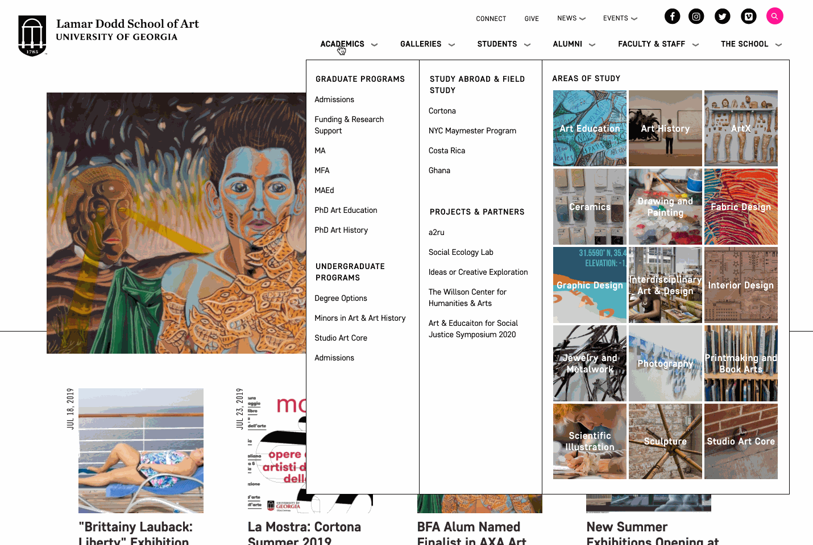

![Lamar Dodd School of Art home page][1]
![Lamar Dodd School of Art mobile views of homepage][2]

The design for the Lamar Dodd School of Art is marked by a clear black and white color scheme and bold typography. Flat design elements are employed to insure easy navigation through the website.

The homepage has slideshow of featured news and events. The homepage also features a feed of recent news and upcoming events and a visually impressive list of the academic areas at the Lamar Dodd School of Art.

## Custom Mega Menu

The Lamar Dodd School of Art website features a mega menu with custom blocks and views. The mega menu allows for site visitors to easily navigate the large website.

## News

![Lamar Dodd School of Art Recent News][3]

The Lamar Dodd School of Art has an active and successful faculty, students and alumni. Therefore there is much to share and celebrate in the 'news' section of the website.
The 'Recent News' page of the website features a feed of articles, as well as a way to filter news by category or academic area.

![Lamar Dodd School of Art mobile views of news pages][4]

The individual news pages feature bold typography for the title, a large featured image, easy-to-read post content and a variety of linked tags and categories. The "More Dodd News" section allows you to navigate to other news articles.

![Lamar Dodd School of Art news story][5]

## Events
![Lamar Dodd School of Art upcoming event][6]

The Lamar Dodd School of Art has a vibrant and active community that hosts a variety of lectures, forums, galleries and educational events.
The list-view of upcoming events are displayed in a unique 3 column layout.

![Lamar Dodd School of Art event page][7]

An individual event page features all the information needed to attend and participate in an event at The Dodd; including time, location, details, speaker info and sponsor. Users are able to add individual events to their personal calendar or they are able to export the entire calendar to their personal calendar feed.

## Directory
The Lamar Dodd School of Art employs a variety of faculty, staff and graduate students. These are the people that make The Dodd an incredible art school, so I wanted to create attractive and informative profiles for them.
The main directory features a feed of faculty that includes their image, name, email and position title. You can filter faculty members by 'area of study' and alphabetically by their last name.

![Lamar Dodd School of Art directory][8]

The individual faculty profiles include a grid of important information that's easy to quickly find. Below the information grid is a bio of the faculty or staff member, research detail, gallery images and news items they have been tagged in.

![Lamar Dodd School of Art faculty profile][9]
![Lamar Dodd School of Art faculty profile mobile views][10]

## Academics
The academics section of the website offers valuable information to prospective students that wish to learn more about what it's like to study at The Dodd.
The main academics page features a list of the degrees and minors offered at The Dodd, as well as list of the areas of study offered at the dodd.

![Lamar Dodd School of Art area of study][11]

An individual area of study serves as a microsite for one of The Dodd's departments. An area of study page features information on the mission of the departments, the courses offered and achievements of its students and faculty. The area of study pages also feature upcoming events and recent news in the department, as well as a faculty list of those that teach in the department.

## Galleries
The Lamar Dodd School of Art courses are where you learn and create art, but the galleries is where you showcase it. The Dodd has a robust amount of galleries in the School of Art main building that feature an evolving showcase of faculty, visiting artist and student work.
The galleries section of the site allows users to learn more about current, upcoming and past exhibitions. You can also submit a proposal for an exhibition through the site.

![Lamar Dodd School of Art galleries][12]

![Lamar Dodd School of Art galleries mobile][13]

![Lamar Dodd School of Art individual gallery page][14]

Every element of the Lamar Dodd School of Art website is mobile-friendly. Students, faculty, alumni and prospective students can access the Lamar Dodd website from their smart phone, tablet or any other device.

The Lamar Dodd website features a continuous design throughout that includes large visuals, gradients and bold typography.

[1]: ../assets/img/portfolio/ld/home.png
[2]: ../assets/img/portfolio/ld/home-mobile.png
[3]: ../assets/img/portfolio/ld/recent-news.png
[4]: ../assets/img/portfolio/ld/news-mobile.png
[5]: ../assets/img/portfolio/ld/news-story.png
[6]: ../assets/img/portfolio/ld/upcoming-events.png
[7]: ../assets/img/portfolio/ld/event.png
[8]: ../assets/img/portfolio/ld/directory.png
[9]: ../assets/img/portfolio/ld/profile.png
[10]: ../assets/img/portfolio/ld/profile-mobile.png
[11]: ../assets/img/portfolio/ld/acad-area.png
[12]: ../assets/img/portfolio/ld/galleries.png
[13]: ../assets/img/portfolio/ld/galleries-mobile.png
[14]:  ../assets/img/portfolio/ld/gallery.png
