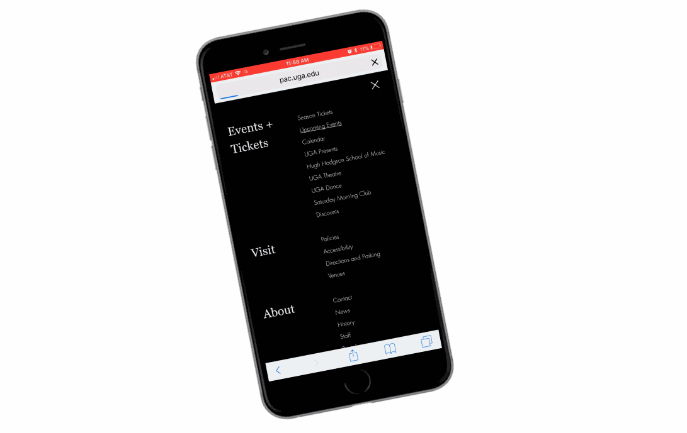

![UGA Performing Arts Center home page][1]

![UGA Performing Arts Center home mobile view][2]

![UGA Performing Arts Center home ipad view][3]

The University of Georgia Performing Arts Center is a cultural center that hosts a variety of performances, including music, dance and acting performances. The Performing Arts Center has two incredible venue spaces: Hugh Hodgson Concert Hall and Ramsey Concert Hall. Both venues are state-of-the-art facilities that bring internationally recognized artists and performers to Athens, GA.

The Performing Arts Center's old website was outdated, hard to navigate and not mobile-friendly. It was also difficult for the staff to update the website. They needed a website that could properly showcase the world renowned performances they host -- and that's where I came in!

My goal for the Performing Art's website was to create an interactive and attractive way to inform users on upcoming events. I also wanted the design to reflect and honor the iconic venues of the Performing Arts Center through elegant typography, clean design and bold, red pops of color.

## Events

The most important element of the Performing Arts Center website

![UGA Performing Arts Center upcoming events][4]

![UGA Performing Arts Center calendar][5]

The Performing Arts Website is not a static surface for static information. It is an interactive, animated website that showcases the incredible performances that the Performing Arts Center puts on. I achieved this through on-scroll animation, animated buttons and animated side menus.

![UGA Performing Arts Center event][6]

![UGA Performing Arts Center season][7]

Showcasing the incredible photography of the Performing Arts Center performances was top priority for the redesign. I made the visuals a primary focus by giving the website a clean, minimal design.

Scrolling through the Performing Arts Center season is a treat due to clean mobile-design and on-scroll animation. All elements of the events -- from the calendar, list view, venue profiles and individual event pages are custom design and functionality.

## Venues

![UGA Performing Arts Center venues][8]

![UGA Performing Arts Center venue][9]

![UGA Performing Arts Center venue mobile view][10]

## Menus
![UGA Performing Arts Center menu interaction][11]
![UGA Performing Arts Center menu mobile][12]

Here is a view of the full Performing Arts Center season. The blend of serif and sans-serif typography give a sophisticated look. The red "find out more" button provides a clear target for those wanted to learn more about the events.
Here is a showcase of individual event pages. The pages have a dense amount of information, but it is laid out in a way for the visuals to grab the visitors attention.

[1]: ../assets/img/portfolio/pac/home.jpg
[2]: ../assets/img/portfolio/pac/home-mobile.jpg
[3]: ../assets/img/portfolio/pac/ipad.jpg
[4]: ../assets/img/portfolio/pac/upcoming-events.jpg
[5]: ../assets/img/portfolio/pac/calendar.jpg
[6]: ../assets/img/portfolio/pac/event.jpg
[7]: ../assets/img/portfolio/pac/season.jpg
[8]: ../assets/img/portfolio/pac/venues.jpg
[9]: ../assets/img/portfolio/pac/venue.jpg
[10]: ../assets/img/portfolio/pac/venue-mobile.jpg
[11]: ../assets/img/portfolio/pac/pac-menu2.gif
[12]: ../assets/img/portfolio/pac/mobile-menu.jpg
