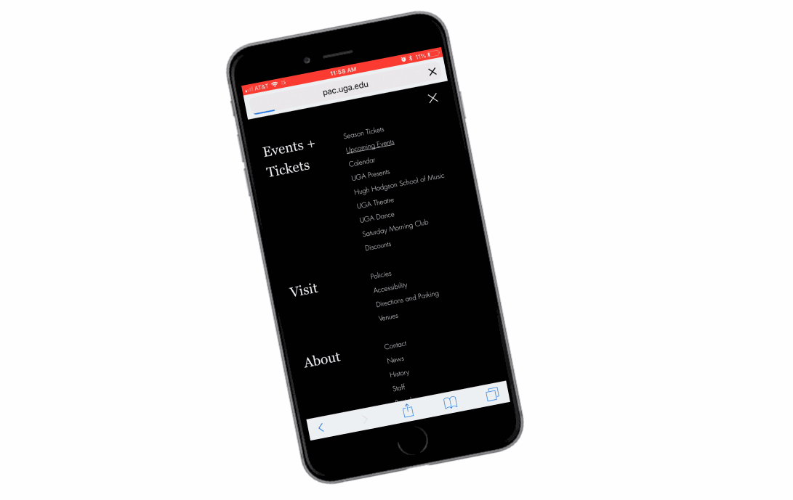

![UGA Performing Arts Center home page][1]

The University of Georgia Performing Arts Center is a cultural center that hosts a variety of performances, including music, dance and acting performances. The Performing Arts Center has two incredible venue spaces: Hugh Hodgson Concert Hall and Ramsey Concert Hall. Both venues are state-of-the-art facilities that bring internationally recognized artists and performers to Athens, GA.

![UGA Performing Arts Center home mobile view][2]

The Performing Arts Center's old website was outdated, hard to navigate and not mobile-friendly. It was also difficult for the staff to update the website. They needed a website that could properly showcase the world renowned performances they host -- and that's where I came in!

![UGA Performing Arts Center home ipad view][3]

My goal for the Performing Art's website was to create an interactive and attractive way to inform users on upcoming events. I also wanted the design to reflect and honor the iconic venues of the Performing Arts Center through elegant typography, clean design and bold, red pops of color.

## Events

The most important element of the Performing Arts Center website is the calendar of upcoming events. The calendar system features an interactive list view and calendar view of upcoming events, that can be sorted by venue or category.

![UGA Performing Arts Center upcoming events][4]

The Performing Arts Website is not a static surface for static information. It is an interactive, animated website that showcases the incredible performances that the Performing Arts Center puts on. I achieved this through on-scroll animation, animated buttons and animated side menus.

![UGA Performing Arts Center calendar][5]

Here is a showcase of individual event pages. The pages have a dense amount of information, but it is laid out in a way for the visuals to grab the visitors attention.

![UGA Performing Arts Center event][6]

Showcasing the incredible photography of the Performing Arts Center performances was top priority for the redesign. I made the visuals a primary focus by giving the website a clean, minimal design.

Here is a view of the full Performing Arts Center season. The blend of serif and sans-serif typography give a sophisticated look. The red "find out more" button provides a clear target for those wanted to learn more about the events.

![UGA Performing Arts Center season][7]

Scrolling through the Performing Arts Center season is a treat due to clean mobile-design and on-scroll animation. All elements of the events -- from the calendar, list view, venue profiles and individual event pages are custom design and functionality.

## Venues

The Performing Arts Center holds two venues, Hugh Hodgson Concert Hall and Ramsey Concert Hall. However, The Performing Arts Center supports and promotes many other performances on campus that are held at other campus venues.

The venues page features a list of all the venues Performing Arts Center supports on campus.

![UGA Performing Arts Center venues][8]

![UGA Performing Arts Center venue][9]

![UGA Performing Arts Center venue mobile view][10]

## Menus

The Performing Arts Center website has multiple interactive menus. The primary main menu provides links to all the site's pages and the collapsed menu in the right corner provides quick information on the center's location and contact information.

![UGA Performing Arts Center menu interaction][11]

Every website I build has a custom mobile menu. Most users visit websites on their smart phones, so I make sure the site is easily navigable from smart phones as well as laptops. The custom mobile menu for The Performing Arts Center opens to full screen for easy legibility and navigation.

![UGA Performing Arts Center menu mobile][12]

[1]: ../assets/img/portfolio/pac/home.jpg
[2]: ../assets/img/portfolio/pac/home-mobile.jpg
[3]: ../assets/img/portfolio/pac/ipad.jpg
[4]: ../assets/img/portfolio/pac/upcoming-events.jpg
[5]: ../assets/img/portfolio/pac/calendar.jpg
[6]: ../assets/img/portfolio/pac/event.jpg
[7]: ../assets/img/portfolio/pac/season.jpg
[8]: ../assets/img/portfolio/pac/venues.jpg
[9]: ../assets/img/portfolio/pac/venue.jpg
[10]: ../assets/img/portfolio/pac/venue-mobile.jpg
[11]: ../assets/img/portfolio/pac/pac-menu2.gif
[12]: ../assets/img/portfolio/pac/mobile-menu.jpg
