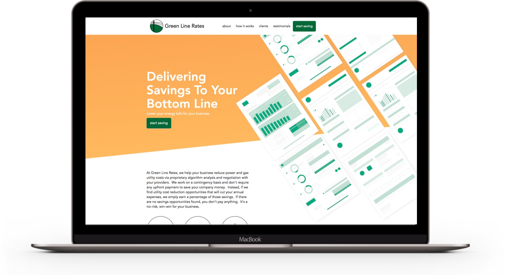
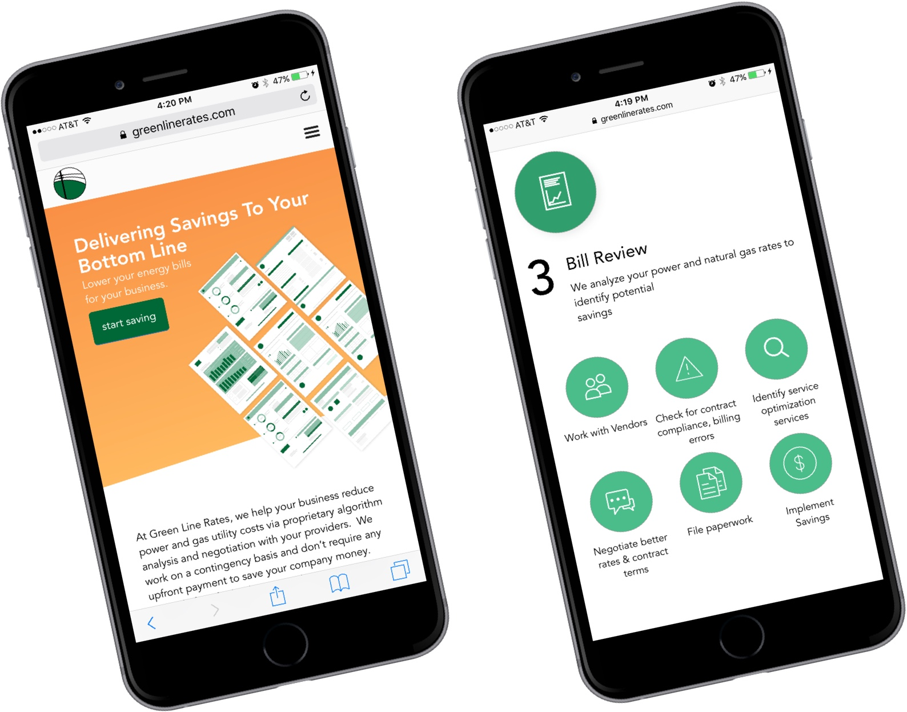
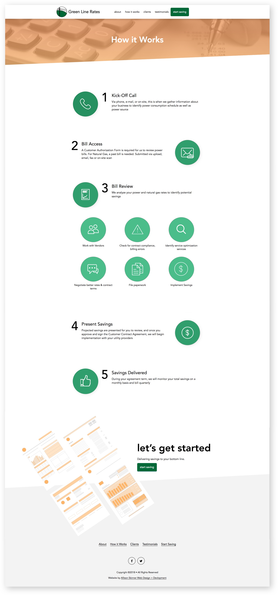
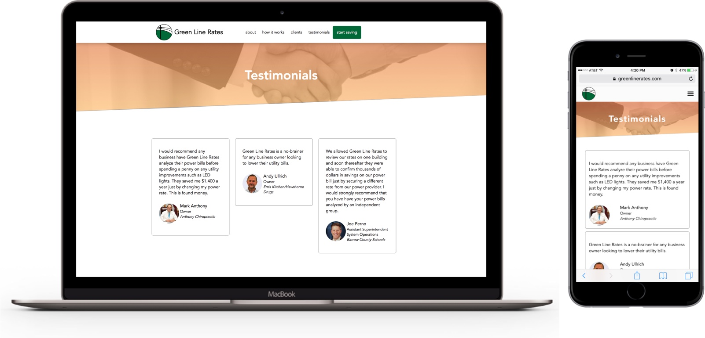
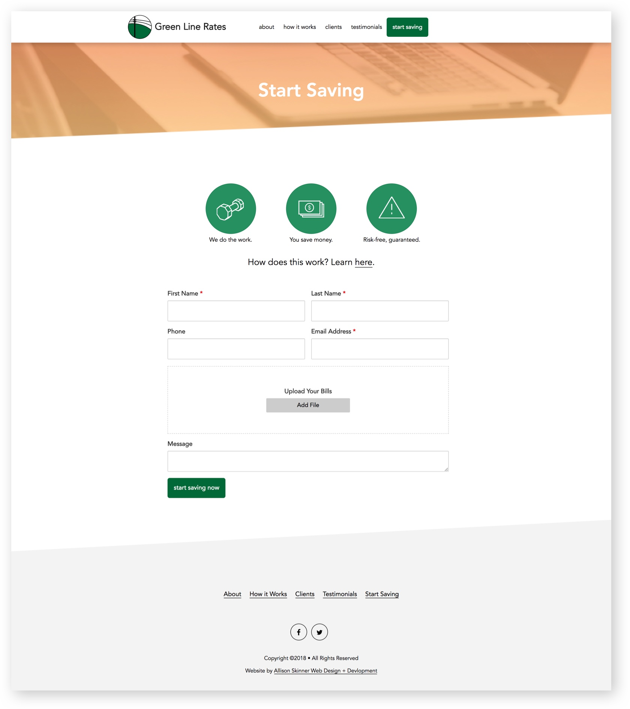

The homepage features an SVG graphic that I personally designed. The heart of Greenline Rates is energy bills, so I wanted to create a striking visual that would not be possible with a standard stock photo. I also incorporated skewed lines throughout the site to promote a unique and modern look.

The Greenline Rates website is mobile-friendly (as well as tablet, laptop and desktop friendly). For this website, I also designed custom icons for the different steps and processes associated with their business. This was a creative challenge to turn a body of text into an interactive feature that visitors could understand easily.

The 'How It Works' page is a great example of how custom icon design, typography and white space can transform a body of text. Greenline Rates is a unique business that needs to explain their process to explain their clients' savings. At the bottom of each page of the website, is a 'Let's Get Started' call-to-action that allows visitors to get in contact with Greenline Rates from every page.

The 'Testimonials' page features a mobile-friendly masonry layout of testimonials. From the backend, the client can easily add testimonials.

The 'Start Saving' page features a contact form where users can upload files of their energy bills for Greenline Rates to assess. I made the website a secure place for users to upload private information through SSL encryption.
