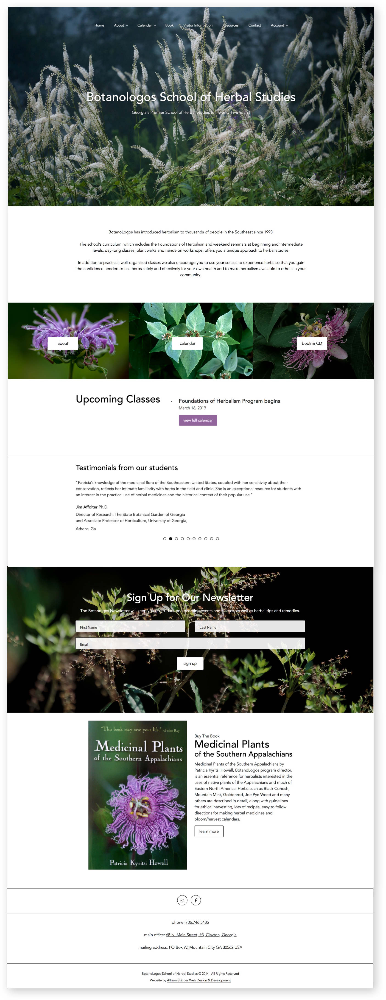
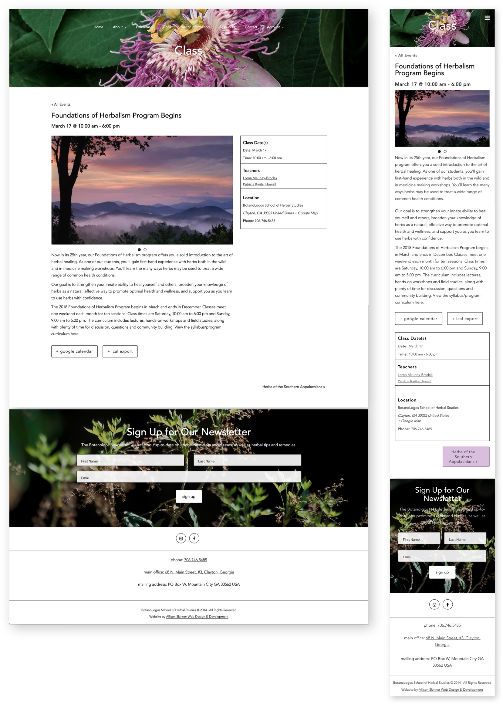
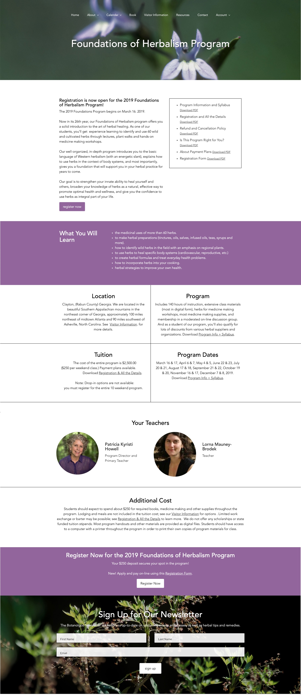

The Botanologos School of Herbal Studies needed a website that provided information on upcoming events and classes, but also touched on the beauty of nature. Botanologos used images from their local applachain terrain to populate the website. The central plant to Botanologos is the passionflower, and it's imagery is featured throughout the website. The homepage features upcoming classes, testimonials, newsletter sign-up and feature on the owner's book.

A mobile view of the responsive website. The primary color of the website is a purple pulled from the passionflower's bloom. The calendar is interactive, responsive and features a custom design that matches the rest of the website.

The individual class pages feature a wealth of information, including the date, time and location of the class, as well as description and gallery of images. Students can sign up and pay for classes directly from the website.

Botanologos School of Herbal Studies is located in the southern Appalachain mountains, where there is a vibrant wilderness that has provided inspiration and guidance to Patricia Kyristi Howell, owner of Botanologos, for the past 25 years.

