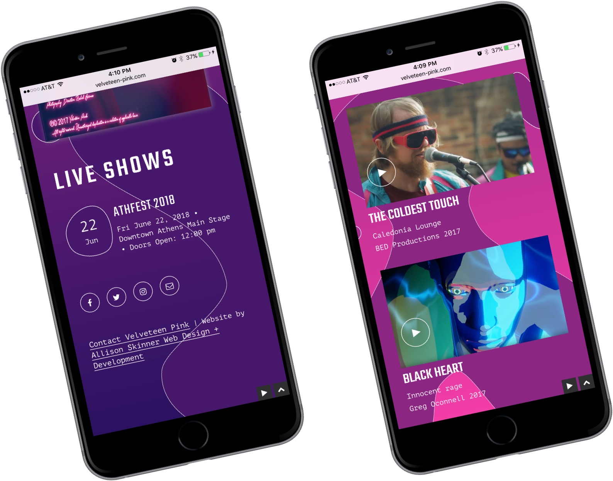
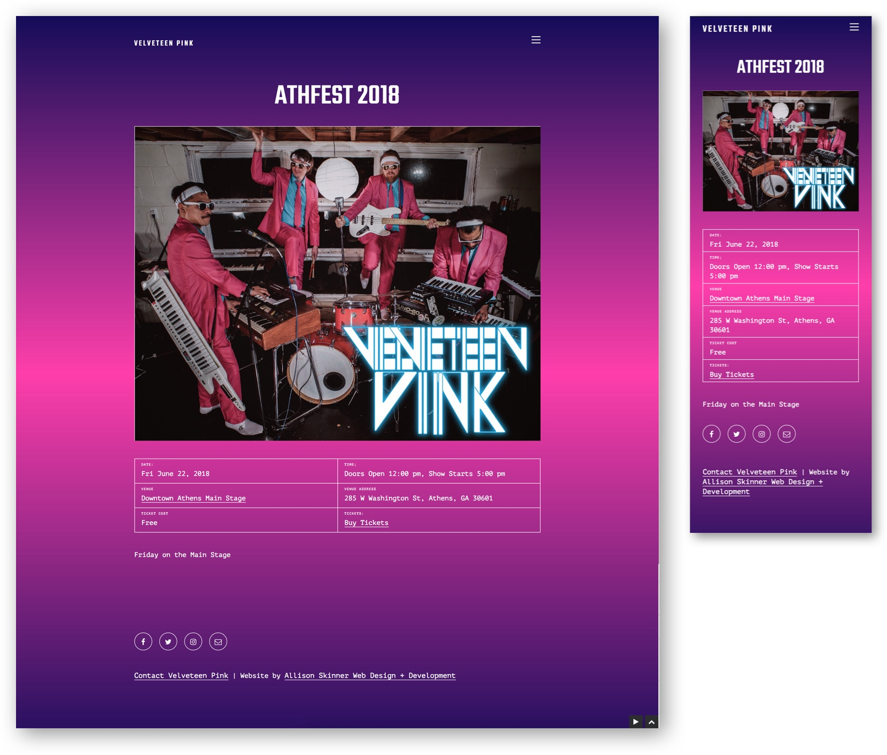
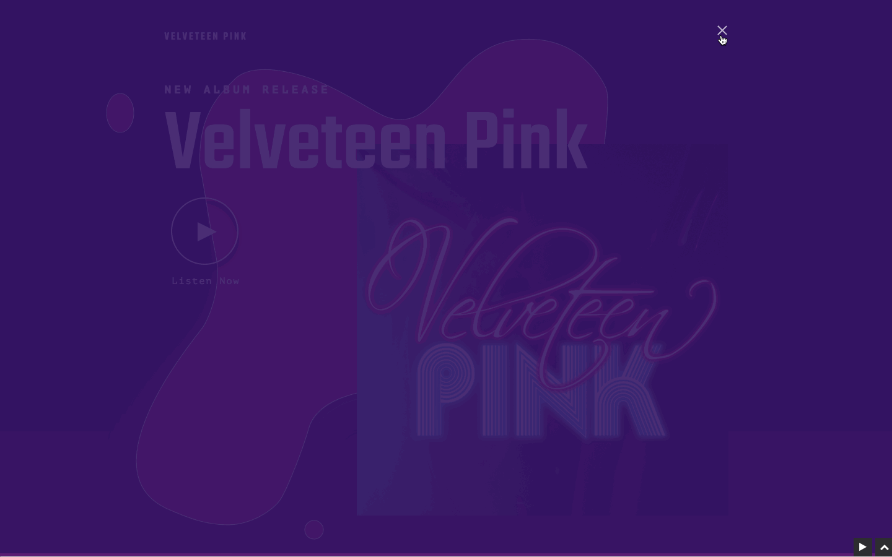

Velveteen Pink's homepage features a rich gradient of purples and pinks, with parallax floating bubbles. The bubbles and colors were inspired by the cover art of their latest album, Velveteen Pink. The website features a dark-scale design (aka white text on a dark background). When a user lands on the homepage their latest album immediately starts playing. As user's visit other pages of the site, the music continues with stopping.

A mobile view of the responsive site. The shape of bubbles inspired a variety of elements on the site, including the custom shape surrounding event dates.

Here is an example of an individual event page. The event page features visuals and a grid of information. The design is mobile-friendly for those visiting the site via their smart phones.

It was important that visitors could listen to Velveteen Pink's new album directly from the site. I did this by incorporating a music player plugin. I customized the colors, typography and overall design of the music player to match the aesthetic of the rest of the site.

This is a feed of Velveteen Pink's music videos. Users can click on the video placeholder image and a modal will open to automatically play the music video.
