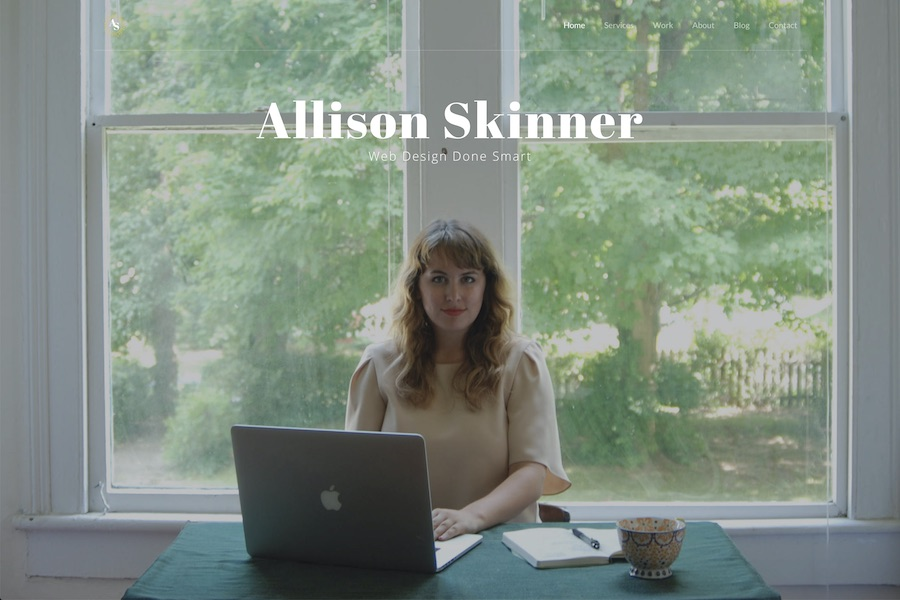

>In August 2016, I launched [allisondskinner.com](https://allisondskinner.com). At the time, I thought it was going to be a basic portfolio site that would garner a few freelance clients to supplement my full-time job income. However, two days after launching my portfolio site, I didn’t have a full-time job anymore and now my portfolio website represented my full-time business.

(If you want to learn more about my origin story, [keep reading here](/writing/One-Year-Full-Time-Freelancing-What-Ive-Learned-Pt-1).) I’m proud of my 2016 portfolio because it brought me solid, recurring business for over two years, but there were some flaws with the site.
By 2018, I wanted to redo my portfolio site because my business had evolved in so many ways and because the site was such a pain to update.

## The following were the main issues I had with my 2016 portfolio website:

### 1. I bought a premium HTML theme for my portfolio website
Which means, I didn’t truly design my portfolio website and I didn’t write all the code. Here's the [theme](https://themeforest.net/item/sartre-creative-multipurpose-html-template/13912008) I bought, if you're interested! This was the best choice for my skill level at the time, but two years later it was an internal embarrassment. I design and build custom themes for all my clients, so my portfolio should reflect that level of craftsmanship.

### 2. Being a raw HTML website, there was nothing dynamic about the website and it was tedious to manage a blog.
If I wanted to publish a blog post, not only did I have to hand code the post, but then I had to hand code it into my blog feed, the mini blog feed on my homepage and on the ‘recent posts’ sidebar on every past blog post. With a little PHP (or liquid or twig) that could all be done dynamically.

### 3. I cater to everyone in how I market and describe my business
When I launched my business, I was available and interested in any web project — any budget, any industry, any deadline. This is a good business plan if you need a lot of business asap, but it’s not very good if you want to become an expert in any niche type of website design or development. Now, I want my portfolio website to appeal to my dream clients -- which are creative, hard-working businesses that need a website to work hard for them!

## My main goals for my new 2019 portfolio site are the following:

### 1. A unique, experimental design that I usually don’t have the opportunity to design/build for a client
My 2016 portfolio design is mostly based off the HTML theme I purchased, for my new 2019 portfolio website I wanted it to be 100% Allison through and through. Bright colors, split page navigation, bold typography. I wanted my portfolio website to appeal to creative businesses that don’t want a cookie-cutter website.

### 2. An easier way to write and share blog posts
When writing for my old portfolio site, it was so tedious to publish anything — think raw html, copying and pasting the same blocks of code over and over again from page to page. For my new portfolio website, I didn’t want a bloated CMS but I knew I had to have some kind of platform that I could manage a blog easily from.

### 3. Keep my high SEO rankings and fast page load times.
The two big things that worked on my portfolio website was that it ranked well on google search results and that it loaded really fast. I can attribute this to having a raw HTML website with no heavy CMS or database to load. It was clean, lean code and google rewarded me for it. And I want to keep it that way!

>After reviewing my goals for my next portfolio site, the path was clear for me — I wanted to build a static site with [Jekyll](https://jekyllrb.com/) and host it on [github pages](https://pages.github.com/). What is Jekyll and why am I using it for my portfolio website? What does it mean to host with github pages? Keep reading in my [next post](/writing/Why-I-chose-to-build-my-portfolio-site-on-jekyll)!
